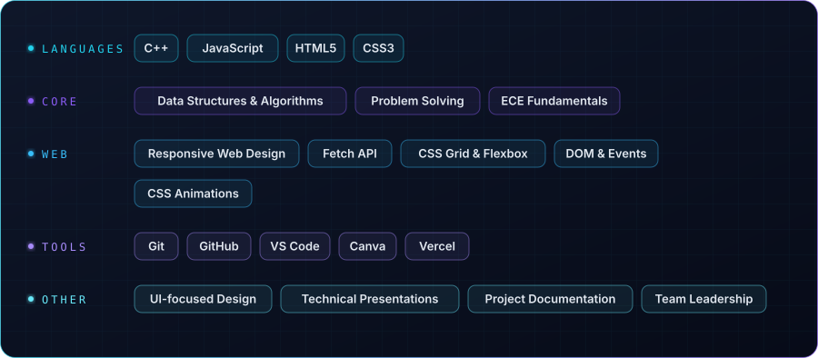

<!-- RITUVERSE · GitHub Profile · Ritu Yadav -->
<!-- Hand-built, section by section. All custom assets live in ./assets -->

<div align="center">

<a href="https://github.com/RituVerse">
  
</a>

<br>

<h1>Ritu Yadav</h1>

<p>
  <strong>The Girl Who Builds</strong><br>
  <sub>B.Tech ECE @ University of Lucknow · Web Developer · C++ &amp; DSA · Hackathon Builder</sub>
</p>

<p>
  <a href="https://github.com/RituVerse">
    
  </a>
  <a href="https://linkedin.com/in/ritu-yadav-71b887382">
    
  </a>
  <a href="mailto:ritu.yadav959743@gmail.com">
    
  </a>
</p>


</div>

<br>
<!-- ───────────────────────── 01 · ABOUT ───────────────────────── -->



<table>
<tr>
<td width="60%" valign="top">

I'm **Ritu**, a second-year **Electronics & Communication Engineering** student at the **University of Lucknow** who fell in love with building for the web.

I like taking an idea from a blank editor to a polished, responsive interface — thinking about layout, hierarchy and detail the same way I think about the logic underneath. Alongside web development, I'm sharpening my fundamentals with **C++ and Data Structures &amp; Algorithms**, and I enjoy the pressure and teamwork of **hackathons**.

**RituVerse** is my corner of GitHub: the things I've built, the problems I've solved, and the ones I'm still working on.

</td>
<td width="40%" valign="top">

```yaml
name:       Ritu Yadav
alias:      RituVerse
role:       ECE Student · Web Developer
degree:     B.Tech, Electronics & Communication
university: University of Lucknow
batch:      2025 – 2029  (2nd year)
cgpa:       7.94  (1st year)
class_xii:  90.2%
base:       Lucknow, Uttar Pradesh, India
focus:      Front-end · C++ · DSA
status:     open to collaborations
```

</td>
</tr>
</table>

<br>
<!-- ───────────────────────── 02 · TECH STACK ───────────────────────── -->



<div align="center">



<sub>Zero frameworks so far — everything I've shipped is pure HTML, CSS and vanilla JavaScript, by choice, to learn the fundamentals first.</sub>

</div>

<br>
