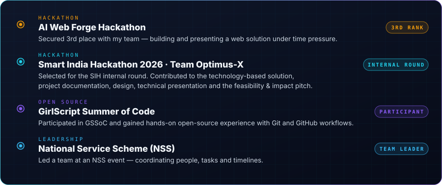

<!-- RITUVERSE · GitHub Profile · Ritu Yadav -->
<!-- Hand-built, section by section. All custom assets live in ./assets -->

<div align="center">

<a href="https://github.com/RituVerse">
  
</a>

<br>

<h1>Ritu Yadav</h1>

<p>
  <strong>The Girl Who Builds</strong><br>
  <sub>B.Tech ECE @ University of Lucknow · Web Developer · C++ &amp; DSA · Hackathon Builder</sub>
</p>

<p>
  <a href="https://github.com/RituVerse">
    
  </a>
  <a href="https://linkedin.com/in/ritu-yadav-71b887382">
    
  </a>
  <a href="mailto:ritu.yadav959743@gmail.com">
    
  </a>
</p>


</div>

<br>
<!-- ───────────────────────── 01 · ABOUT ───────────────────────── -->


<table>
<tr>
<td width="60%" valign="top">

I'm **Ritu**, a second-year **Electronics & Communication Engineering** student at the **University of Lucknow** who fell in love with building for the web.

I like taking an idea from a blank editor to a polished, responsive interface — thinking about layout, hierarchy and detail the same way I think about the logic underneath. Alongside web development, I'm sharpening my fundamentals with **C++ and Data Structures &amp; Algorithms**, and I enjoy the pressure and teamwork of **hackathons**.

**RituVerse** is my corner of GitHub: the things I've built, the problems I've solved, and the ones I'm still working on.

</td>
<td width="40%" valign="top">

```yaml
name:       Ritu Yadav
alias:      RituVerse
role:       ECE Student · Web Developer
degree:     B.Tech, Electronics & Communication
university: University of Lucknow
batch:      2025 – 2029  (2nd year)
cgpa:       7.94  (1st year)
class_xii:  90.2%
base:       Lucknow, Uttar Pradesh, India
focus:      Front-end · C++ · DSA
status:     open to collaborations
```

</td>
</tr>
</table>

<br>
<!-- ───────────────────────── 02 · TECH STACK ───────────────────────── -->


<div align="center">


<sub>Zero frameworks so far — everything I've shipped is pure HTML, CSS and vanilla JavaScript, by choice, to learn the fundamentals first.</sub>

</div>

<br>
<!-- ───────────────────────── 03 · PROJECTS ───────────────────────── -->



<div align="center">

<a href="https://github.com/RituVerse/my-portfolio">
  
</a>

<table>
<tr>
<td width="50%">
<a href="https://github.com/RituVerse/weather-app">
  
</a>
</td>
<td width="50%">
<a href="https://github.com/RituVerse/Netflix-Clone">
  
</a>
</td>
</tr>
</table>

<p>
  <a href="https://rituverse.github.io/my-portfolio/"></a>
  <a href="https://github.com/RituVerse/my-portfolio"></a>
  <a href="https://github.com/RituVerse/weather-app"></a>
  <a href="https://github.com/RituVerse/Netflix-Clone"></a>
</p>

<sub>More projects are on the way — the universe is still expanding. See all repositories at <a href="https://github.com/RituVerse?tab=repositories">github.com/RituVerse</a>.</sub>

</div>

<br>
<!-- ───────────────────────── 04 · ACHIEVEMENTS ───────────────────────── -->



<div align="center">



</div>

<br>
<!-- ───────────────────────── 05 · DSA JOURNEY ───────────────────────── -->



<table>
<tr>
<td width="50%" valign="top">

Building strong fundamentals in **C++**, one pattern at a time — with regular practice on **LeetCode**.

**Topics covered so far**

| Area | Patterns & Algorithms |
|:--|:--|
| Arrays | Traversal, prefix logic, in-place tricks |
| Searching | Linear Search · **Binary Search** |
| Classic algorithms | **Kadane's Algorithm** · **Moore's Voting Algorithm** |
| Techniques | **Two Pointer Technique** · **Binary Exponentiation** |

**Up next:** Strings · Recursion · Sorting · Hashing

</td>
<td width="50%" valign="top">

```cpp
// Kadane's Algorithm — maximum subarray sum
// O(n) time · O(1) space
int maxSubArray(vector<int>& nums) {
    int best = nums[0];
    int curr = nums[0];
    for (int i = 1; i < nums.size(); ++i) {
        curr = max(nums[i], curr + nums[i]);
        best = max(best, curr);
    }
    return best;
}
```

<div align="center">
<a href="https://leetcode.com/"></a>

</div>

</td>
</tr>
</table>

<br>

<!-- ───────────────────────── 06 · OPEN SOURCE ───────────────────────── -->



<div align="center">

<table>
<tr>
<td align="center" width="33%" valign="top">
<br>
<strong>GirlScript Summer of Code</strong><br>
<sub>Learned the real-world open-source loop: fork → branch → commit → pull request → review.</sub>
<br><br>
</td>
<td align="center" width="33%" valign="top">
<br>
<strong>Git &amp; GitHub</strong><br>
<sub>Comfortable with branching, meaningful commits, PRs, issues and keeping a clean history.</sub>
<br><br>
</td>
<td align="center" width="33%" valign="top">
<br>
<strong>Open to collaborate</strong><br>
<sub>Front-end, documentation and beginner-friendly issues — if you're building something, say hi.</sub>
<br><br>
</td>
</tr>
</table>

</div>

<br>
<!-- ───────────────────────── 07 · GITHUB ACTIVITY ───────────────────────── -->



<div align="center">

<a href="https://github.com/RituVerse?tab=repositories">
  
</a>
<a href="https://github.com/RituVerse?tab=repositories">
  
</a>

<br>

<a href="https://github.com/RituVerse">
  
</a>

<sub>Live data via <a href="https://github.com/anuraghazra/github-readme-stats">github-readme-stats</a> and <a href="https://github.com/DenverCoder1/github-readme-streak-stats">streak-stats</a>. Early days — the graph grows with every build.</sub>

</div>

<br>
<!-- ───────────────────────── 08 · LET'S CONNECT ───────────────────────── -->



<div align="center">

Whether it's a hackathon team, an open-source issue, a front-end idea or just a hello — my inbox is open.

<br>

<a href="https://linkedin.com/in/ritu-yadav-71b887382">
  
</a>
<a href="mailto:ritu.yadav959743@gmail.com">
  
</a>
<a href="https://github.com/RituVerse">
  
</a>

<br><br>

<sub>Lucknow, Uttar Pradesh, India &nbsp;·&nbsp; Usually responds within a day or two.</sub>

<br><br>


</div>
